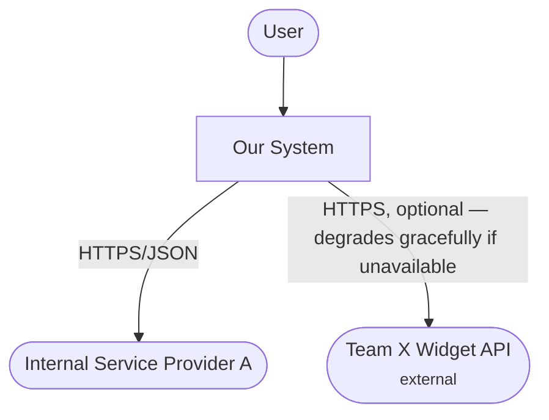
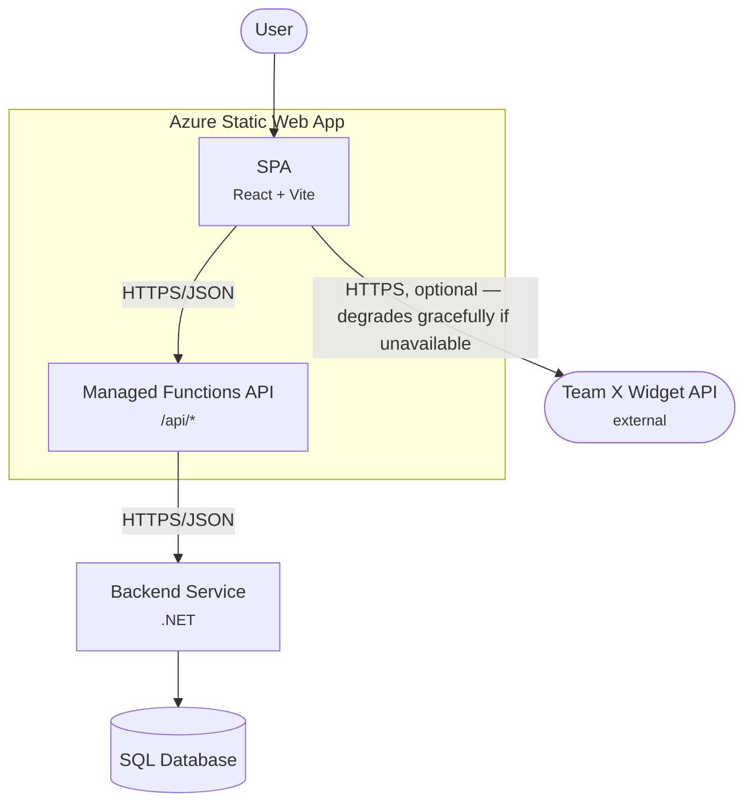
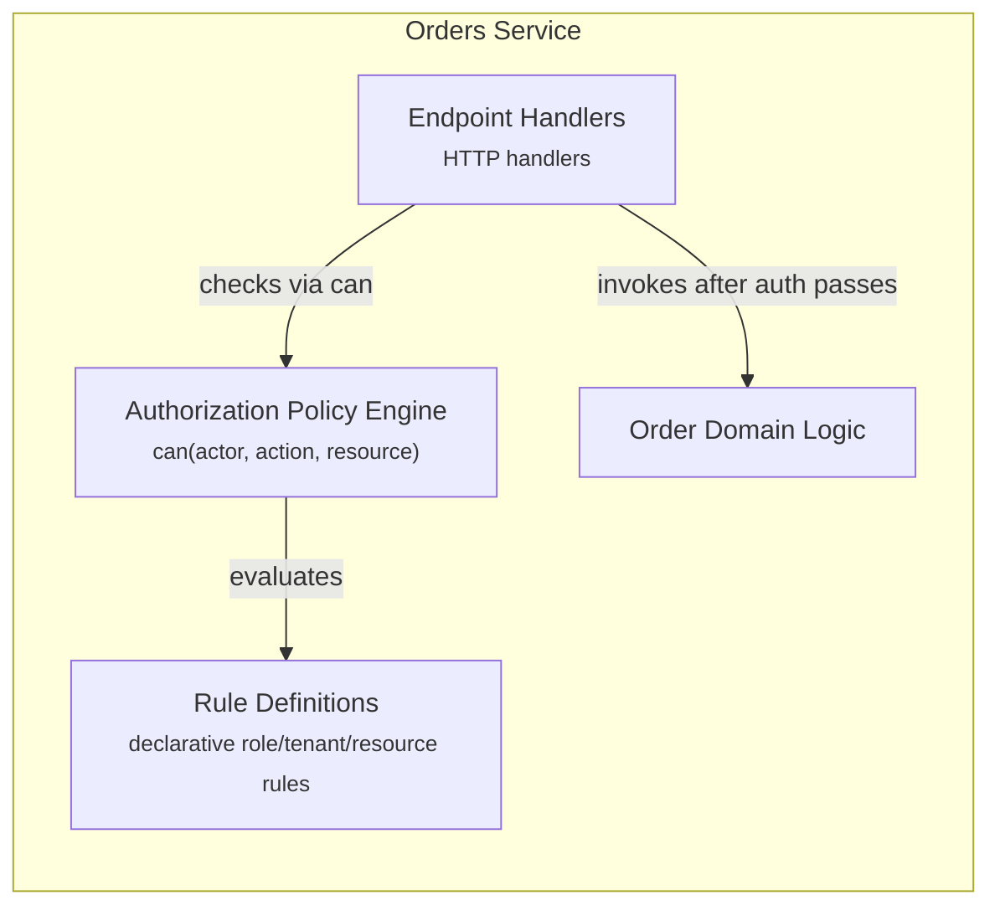

# C4 Diagram Format

Covers all three levels this skill can produce: Context, Container, Component. See `SKILL.md` for when each one is warranted — don't produce all three by default.

## Use `flowchart`, not `C4Context`/`C4Container`/`C4Component`

Mermaid's built-in C4 diagram types have a weak layout engine — edges cross even on small diagrams. Use plain `flowchart` styled to read as C4: one labeled `subgraph` per boundary, one box per element, top-down direction. This uses Mermaid's real auto-router (dagre) and stays readable at every level.

Shape conventions, consistent across all three levels:
- **Person**: `user(["User"])` — stadium shape.
- **External system** (another team's API, a third-party provider, anything not yours): `widget(["Name <small>external</small>"])` — stadium shape, labeled `external`.
- **Container / component box**: `name["Name <small>tech/role</small>"]` — rectangle.
- **Datastore**: `db[("SQL Database")]` — cylinder shape.
- **Boundary**: a labeled `subgraph`.

Relationship labels carry protocol and criticality: `"HTTPS/JSON"` for a normal required call; append `", optional — degrades gracefully if unavailable"` when that's true. Don't drop this to save space — it's the single most useful fact a relationship label can carry.

## Context — `docs/architecture/context.md`

The system as one box, its users, and the external systems it talks to. No internals. Changes rarely — only when a genuinely new external dependency enters the picture.

## Container — `docs/architecture/container.md`

What talks to what inside the system: SPA, managed Functions (if any), backend service(s), datastores, external systems. This is the default, most-produced level — the "solution level" view.

Notes for this stack:
- **SPA and managed Functions are separate containers**, even though Azure Static Web Apps deploys them together — different runtimes, different failure modes. Only merge them into one box if this repo genuinely has no managed Functions (SPA talks straight to an externally hosted backend instead).
- **Don't enumerate endpoints or params.** The Frontend→Backend relationship stays at protocol level; the actual contract lives in a generated OpenAPI/schema spec (see `ADR-FORMAT.md`, "what doesn't qualify"). Redraw this diagram only when the *nature* of a relationship changes (sync→async, REST→GraphQL, a container added/removed) — never for routine endpoint additions.

## Component — `docs/architecture/components/{container-slug}.md`

Internals of *one* container, only when Phase 2 revealed it's complex enough to need this. One `subgraph` for the container, one box per internal module.

## Updating an existing diagram

If the target file already has a diagram, edit it in place — add or change only what the decision actually changed. These are living diagrams tracking current-state architecture, not one-off illustrations regenerated per decision.
