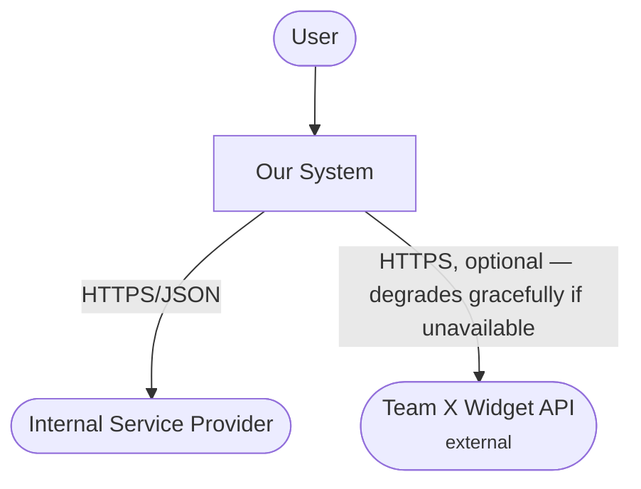
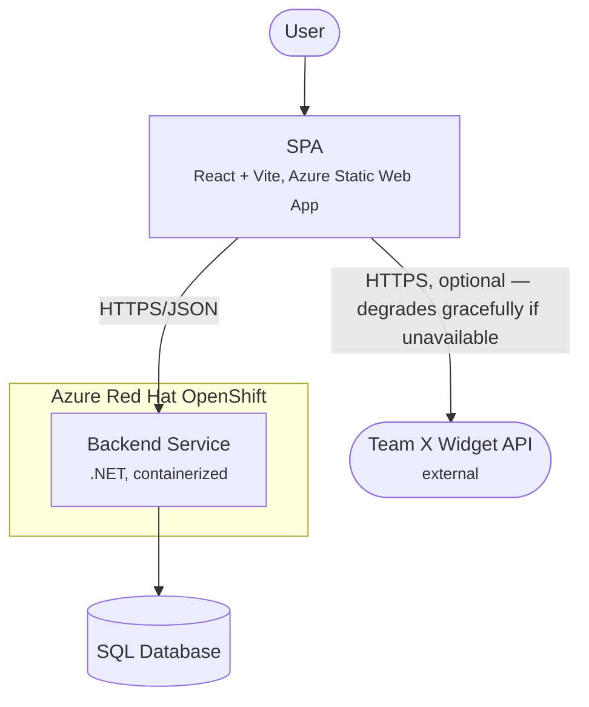
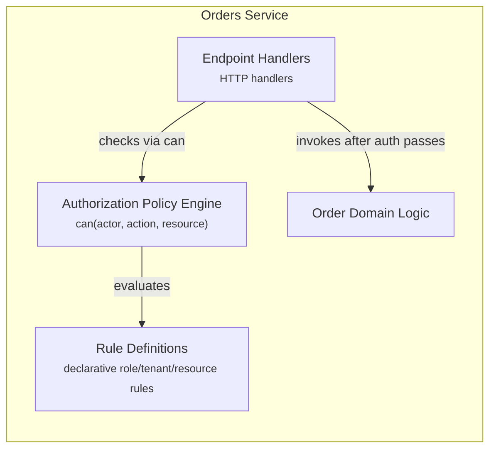

# C4 Diagram Format

Covers all three levels: Context, Container, Component. `SKILL.md` decides which one a finding warrants.

## Flowchart, not `C4Container`

Mermaid's built-in C4 diagram types (`C4Context`, `C4Container`, `C4Component`) run a weak layout engine whose edges cross even on small diagrams. Use plain `flowchart`, styled to read as C4: a labeled `subgraph` per boundary, one box per element, `TD`/`TB` direction. This routes through dagre and stays legible at every level.

Shapes, consistent across levels:

| Element | Syntax |
|---|---|
| Person | `user(["User"])` |
| External system — another team's API, a third party, anything not yours | `widget(["Name <small>external</small>"])` |
| Container or component | `api["Name <small>tech, hosting</small>"]` |
| Datastore | `db[("SQL Database")]` |
| Boundary | a labeled `subgraph` |

Relationship labels carry protocol, plus criticality wherever a dependency is anything other than required: `"HTTPS, optional — degrades gracefully if unavailable"`. That clause is the most useful thing a label holds — it answers "why is this widget blank in prod?" at a glance, so it stays even when space is tight.

## Context — `docs/architecture/context.md`

The system as one box, its users, the external systems it touches. No internals.

## Container — `docs/architecture/container.md`

What talks to what: the SPA, managed Functions where they exist, the OpenShift-hosted service(s), datastores, external systems.

Where the SPA does route `/api/*` to SWA **managed Functions** (`staticwebapp.config.json` settles it), they get their own box between the SPA and the OpenShift service — a separate runtime with its own failure mode. Several OpenShift services sharing a cluster sit as separate boxes inside one `aro` boundary; separate clusters get a boundary each. Match the manifests.

## Component — `docs/architecture/components/{container-slug}.md`

One container's internals, for a container complex enough to warrant it. One `subgraph`, one box per module.

## Living diagrams

An existing diagram is **living**: changed only where the finding changed it, never regenerated whole. In home that is an edit in place; in another repo it is the same edit expressed as a delta (see `SKILL.md`). A Container diagram changes when a relationship's *nature* shifts (sync→async, REST→GraphQL) or a container arrives or leaves — routine endpoint additions leave it untouched.
